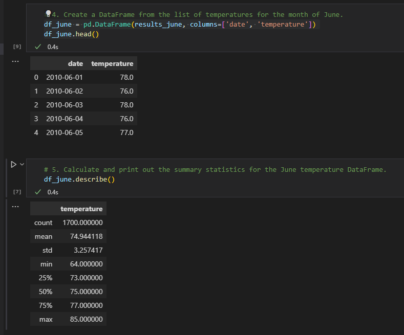
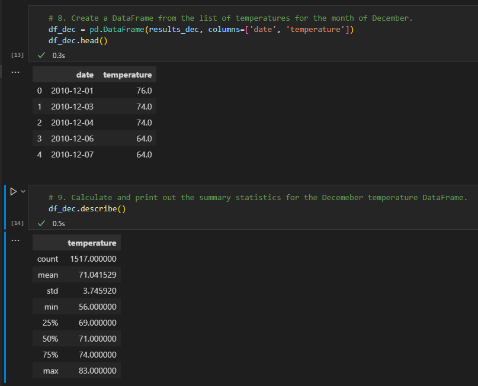

## Surf's Up Project.

### Project Overview.
The sponsor requested the project team analysis, describing more information about temperature trends before opening the surf shop. Specifically, they want temperature data for June and December in Oahu to determine if the surf and ice cream shop business is sustainable year-round.

### Phase 1: Determine the Summary Statistics for June.
At this stage, the team copes with the challenge of analyzing June's temperature averages. To reach that point, an active query is written to retrieve the June temperatures from the date column of the Measurement table; the temperatures are added to a list. The list of temperatures is converted to a Pandas DataFrame, and finally, Summary statistics are generated for the DataFrame.

Handling the data above, the table demonstrates that the weather usually offers decent south temperatures to open the store in June. However, this season will also be drier and warmer. To complete this analysis, it could be an excellent approach to studying the winds; besides the temperatures, it's a condition that calls the surfers to crowded the city.

### Phase 2: Determine the Summary Statistics for December.
The team used the same approach for the previous stage, getting the following results described in the picture below:

The best time to surf, and consequently to open a store in Oahu, depends on the conditions you are looking for. December is the big surfing season on Oahu’s Shore, while temperatures consistently stabilize in the Hawaiian islands. There are also some winds and mellow south swells to be found on the south side of Oahu during this season.

### Summary.
In fact, it's noticed that the average temperatures compared to June and December are 75 and 71 degrees, respectively; this project shows a moderate temperature and minimal fluctuation between the two periods from an average standpoint. In addition, the maximum temperatures of 85 (June) and 83 (December) also behave very similarly. But the similarities stop at that point; the minimum temperature analysis it's a bit tricky. June (64) and December (56) demonstrate a significant variance; it reflects a lower temperature level in December. However, it would be expected considerable variation in the December numbers due to the standard deviation.

As mentioned before, additional queries would be essential to add value to this project, that includes precipitation and winds. Only temperature as a variable doesn't satisfy the analysis proposed by the sponsor. It’s generally accepted that winter is the best time to surf in the city. From early December, mighty winter storms form in the Artic and send swell towards the Hawaiian island chain, so that unique variable demonstrates that only temperatures can be prejudicial to this study because it mascaras in comparison to June.
